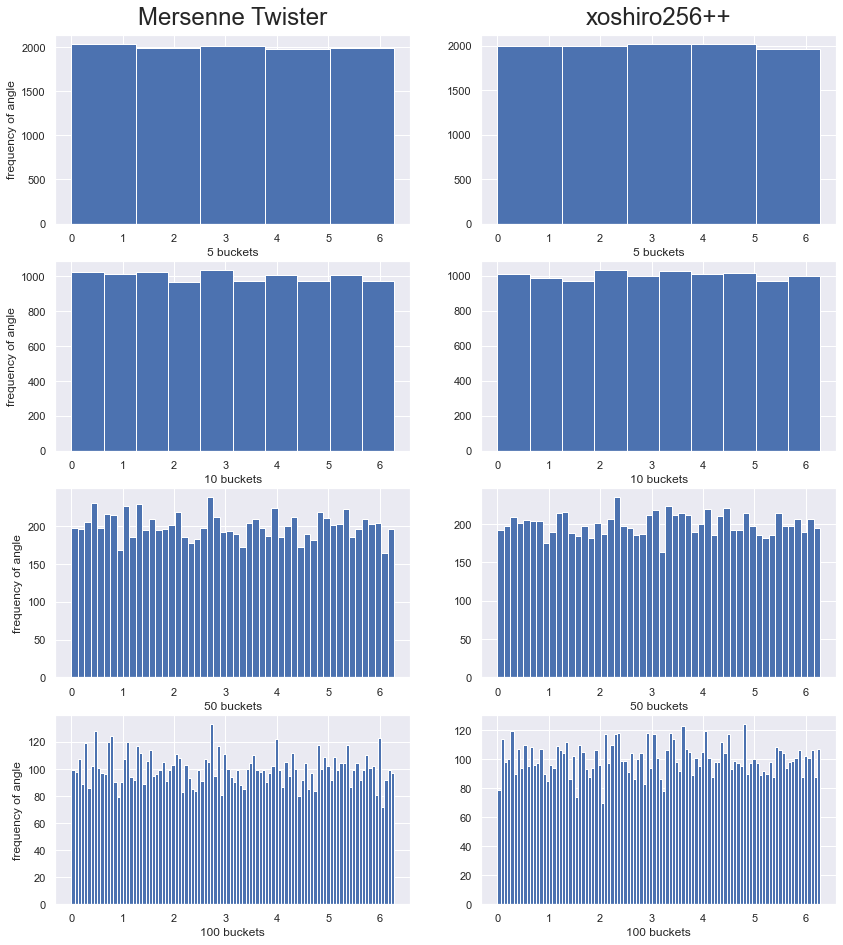
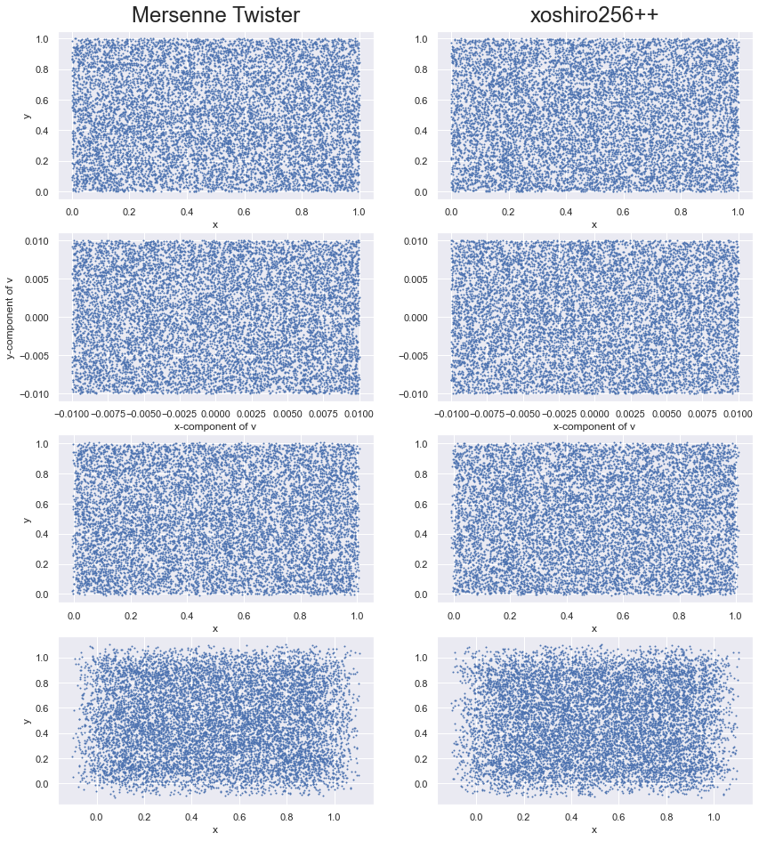

\newcommand{\matr}[1]\textbf{#1}
\newcommand{\vect}[1]{\vec{#1}}


# To my dear supervisors

Dear Professor Likos!
Dear Dr. Bianchi!

Professor Likos, I hope you're enjoying your vacation.

You haven't heard from me in a while because I was on vaction too, but I have started my work on the thesis. 
I will review what we discussed in person and online with Dr. Bianchi, and I hope you are as interested in the
research question as I am. Dr. Bianchi, if you have suggestions for adapting dimensions/parameters of the situation (fluid flow through 2d cross section of pipe with cylindrical obstacles) or even tweak the situation, I would love to hear your suggestions too.
I hope I depicted the situation somewhat well below. I thought it would be interesting to not only try obstacles that are
regularly spaced, all the same size, but try a more heterogeneous situation. But that is still a little ways down the road,
so I'll have to see about that.

Progress-wise I'd say I'm still at the beginning. All the work here has been done in about 1 week. I'm working on the collision step now. It took a lot of time to get familiar with C++ again, and to find out how best to test my results. I think I have found a good way to do this, called unit testing, which basically means you test every unit of your program separately and make sure they work under various circumstances, to make debugging easier later down the road and also to add more credibility to my results.

Please do not worry if the writing style is sometimes informal, and at other times formal. I meant it to be that way, as some sections are unfinished/jumbled down thoughts/still expanding/experimenting. Also, the citing style is not the final version either, unfortunately, I cannot change it at the moment.

I'd be happy to hear your guidance and if everything is looking good, or if you suggest I focus more on other areas. If you have a lot to tell me I'd be happy to meet over Zoom/Teams or in person.

Where possible, I've not cited Wikipedia, or added other sources. Is it still okay if I cite Wikipedia, or is that completely undesirable?

All the best,

Chris

# MPCD simulation of polymers in solution

This notebook will serve as the documentation of our efforts and results for my Bachelor's Thesis. The goal of this thesis will be the study of short/long-chained polymers in a liquid thats flowing around obstacles. The liquid will be simulated with MPCD, or "Multi Particle Collision Dynamics".

I chose the language C++ for its familiar object-oriented nature and its proven execution-time. Output of the simulation will mostly be analysed in Python, specifically with Jupyter Notebook for a blend of beautiful visualizations and convenience. For simplification, the situation will be studied in 2D. The situation we specifically discussed is shown below.


### Open questions & Description of situation

For these questions, I need to expand the program to even consider them. If I get close and still have no idea how to go about them, I will contact Maximilian Liebetreu (I think he was there when we first met, I'm sorry I can't remember exactly). Are there other people I can contact for the programming/implementation details?

The fluid flows from the -x direction through the 2D cross-section of some vessel. In this vessel there are cylindrically shaped objects, through which the fluid cannot pass. (->How will I simulate the obstacles, are they solid non-deformable, are they soft & elastic, ..?) (-> Methods: create a lot of particles and immobilize them?, check for collision between particles and obstacles on a per particle basis? (this will probably be too expensive computationally))

What happens when fluid goes out of bounds? (->Should particles that go too far in the +x direction be destroyed and new ones created from the -x direction, simulating continuous flow?)

Finally, polymers will be introduced into the fluid and their behavior studied. We might imagine this "vessel" as a blood vessel and the obstacles as cells moving around in the bloodstream, for example. (-> For the polymers, you told me I should wait until the MPCD is really working)

# Introduction

Multiparticle collision dynamics (MPCD), also known as Stochastic Rotation Dynamics (SRD)[@winkl2009] is a technique originally introduced to study the dynamics of complex fluids such as polymers in solution. Besides MPCD, there exist other mesoscopic models that have been constructed for this purpose, such as Langevin, Direct Simulation Monte Carlo and lattice Boltzmann methods.[@malev1999] We only concern ourselves with the application of MPCD, it follows that any comparison between methods are out of the scope of this thesis.

The MPCD technique models the fluid using particles, their positions and velocities are treated as continuous variables. The system is divided up into cells that have no restriction on the number of particles, each of the cells is part of a regular lattice. The dynamics is split into two parts: Particle streaming and multiparticle collision dynamics. Particle streaming is treated exactly for each particle in the system, while the collision step is approximated on a cell level. The multiparticle collision dynamics conserves mass, momentum and energy and leads to the correct hydrodynamical equations.[@malev1999] The streaming and collision step are described in more detail in (TODO).

# How does MPCD work?

The system we are modelling consists of $N$ particles with mass $m$, position $\vec{r_{i}}$ and velocity $\vec{v_{i}}$, where $i \in \{1, 2, \dots, N\}$. One timestep shall correspond to having calculated all the new particle positions and velocities in the streaming and collision steps, respectively. For each of the N particles, the streaming and collision steps are applied, and this pattern is repeated until the wanted number of timesteps have elapsed.

## The streaming step

The streaming step is very straightforward. The particle positions are simply updated according to

\begin{equation}
\vect{r_{i}} \rightarrow \vect{r_{i}} + \Delta t \cdot \vect{v_{i}}\textrm{,}
\end{equation}

where $\Delta t$ is a small time interval.[@winkl2009][@malev1999]

## The collision step

The collision step is somewhat more complicated. It involves the mean velocity of all particles in a particular cell, $\vect{V_c}$, the velocity of the particle $i$ $\vec{v_i}$ and a rotation matrix $\matr{R}(\alpha)$. The vector $\vect{v_i}$ is rotated relative to the mean velocity $\vect{V_c}$ of all particles in cell $c$, cell $c$ being the cell which particle $i$ belongs to. It is shown in [@malev1999] that the rule,

\begin{equation}
\vect{v_i} \rightarrow \vect{V_c} + \matr{R}(\alpha) [\vect{v_i} - \vect{V_c}] \textrm{,}
\end{equation}

conserves mass, momentum and energy. The rotation matrix $\matr{R}(\alpha)$ is a simple 2d rotation matrix

\begin{equation}
R(\alpha) = 
\left[ \begin{array}{rr}
cos(\alpha) & -sin(\alpha) \\
sin(\alpha) & cos(\alpha) \\
\end{array}\right]
\end{equation}

It is the same for all particles of a cell, but since $\alpha$ is sampled randomly,  will probably differ from cell to cell. The mean velocity of a cell is defined as

\begin{equation}
\vect{V_c} = \frac{1}{N_c} \sum_{i=1}^{N_c} \vect{v_i} \textrm{,}
\end{equation}

where $N_c$ is the number of particles in the cell.[@malev1999]

# (Pseudo) Random Number Generation

One of the pillars of this thesis is the generation of random rotation angles for the rotation matrix needed in the collision step. This proved to be somewhat difficult. First, the standard algorithm of the C++ standard library was tried, but it didn't qualify because it performed poorly in comparison to the second and third algorithms tried, which are called "Mersenne Twister" and "xoshiro256++", respectively.[@wiki:mersennetwister][@cppreference:prng][@unimi:xoshiro]

The Mersenne Twister was implemented using the C++ standard library. The xoshiro256++ was implemented using Sebastian Vigna's code with some additions.[@unimi:xoshiro]

To compare algorithms, and also to make sure that the implementation of the xoshiro256++ is right, a $\chi^2$ test for discrete observations was used. The generated angles in the interval $[0, 2\pi)$ were split into $k+1$ buckets, where $k$ is the number of degrees of freedom of the $\chi^2$ distribution. The test error

\begin{equation}
T = \sum_{b=1}^{k+1}{\frac{(N_o - E[N_b])^2}{E[N_b]}},
\end{equation}

where $E[N_b] = \frac{N}{b}, b \in \{1, 2, \dots , k+1\}$ is the expected bucket size, is compared to $\chi^2_{1-\alpha, k}$, where $\alpha$ is the signifigance level. The null hypothesis

$$
H_0: \textrm{The angles are distributed uniformly in the interval } [0, 2 \pi)
$$

is tested against the alternative hypothesis

$$
H_1: \textrm{The angles are not distributed uniformly in the interval } [0, 2 \pi) \textrm{.}
$$

If the test should have significance level $\alpha$, $H_0$ is rejected if $T \ge \chi^2_{1-\alpha, k}$.[@fruehwirthstat][@wiki:chisquaredtest][@wiki:goodnessoffit]

The results of the $\chi^2$ test are summarised in [TODO: Table, and table formatting].


\begin{table}[]
\begin{tabular}{|l|c|r|r|}
\textbf{k} & \textbf{chisquared[TODO]} &\textbf{observed MT} & \textbf{observed xoshiro} \\
1                              & 3.841           & 4.709                                    & 0.551                                         \\
2                              & 5.991            & 6.211                                    & 0.58                                          \\
3                              & 7.815                          & 8.137                                    & 1.263                                         \\
4                              & 9.488                          & 11.506                       & 1.776                                         \\
5                              & 11.070                          & 10.954                                   & 3.783                                         \\
6                              & 12.592                          & 19.849                                   & 4.565                                         \\ 
7                              & 14.067                          & 12.545                                   & 3.339                                         \\
8                              & 15.507                          & 14.802                                   & 4.946                             \\
9                              & 16.919                           & 14.101                       & 3.196                                         \\
10                             & 18.307                          & 15.701                       & 5.794                                         \\ 
11                             & 19.675                          & 19.148                                   & 9.452                                         \\
12                             & 21.026                         & 17.072                                   & 6.947                                         \\ 
13                             & 22.362              & 20.366                                   & 10.734                            \\
14                             & 23.685                          & 18.033                                   & 6.426                                         \\ 
15                             & 24.996              & 15.477                                   & 6.75                                          \\
16                             & 26.296                          & 18.604                                   & 8.554                                         \\
17                             & 27.587                           & 21.79                                    & 13.028                            \\
18                             & 28.869                         & 26.316                                   & 9.882                                         \\ 
19                             & 30.144             & 26.845                                   & 14.323                                       
\end{tabular}
\end{table}


As we can see, both generators pass the $\chi^2$ test and we do not have to reject our null hypothesis $H_0$.

Visually, we can examine the generated buckets of both random generators in [TODO] the following plot. 





The Mersenne Twister has been known to fail certain statistical tests since its inception, by virtue of its mathematical characteristics. There exist other algorithms that are designed to be faster and that do not fail any known statistical tests.[@vigna2019] Ultimately, the xoshiro256++, developed by Sebastian Vigna and David Blackman, was used. It is a variant of the xorshift algorithm, which extends the bit-shift and xor methods by bitrotation, making it still very fast, and more "random" than the xorshift.[@wiki:xorshift][@unimi:xoshiro]

Note that testing a (pseudo) random number generator is usually much more involved than this, but since this has already been done extensively by other authors, we are satisfied with the $\chi^2$ test, simply to test the implementation of the xoshiro256++, since it plays an important part.[@wiki:prng][@vigna2019]

# Particle Streaming

The particle positions were drawn from a uniform real distribution in the interval $[0, 5)$ for the $x$-coordinate, and $[0, 1)$ for the $y$-coordinate. The velocities were initialized to be in the interval $[-1\% \cdot 5, 1\% \cdot 5)$ for the $v_x$ component, and $[-1\% \cdot 1, 1\% \cdot 1)$ for the $v_y$ component. The results can be seen [TODO] below. From the positions in the first row, the velocities in the second row, particle streaming is applied for 1 and 10 timesteps, respectively.





We see the x and y coordinates are randomly initialized according to the shape of the container. Looking closely, one can see that our particles look very much like noise. The absolute value of the velocity components are initialized to at most 1% of their respective dimensions. After one timestep, some of the particles on the outer ranges have moved out of bounds, and after ten timesteps, the particles have thinned out considerably along the edges.

# The collision step

## Grid

Work in progress

## Velocity updating

The velocity of a particle updates according to
\begin{equation}
\vect{v_{i}} \rightarrow \vect{V_c} + \matr{R}(\alpha)[\vect{v_i} - \vect{V_c}],
\end{equation}

where $\vect{v_{i}}$ is the velocity of the $i-th$ particle, $\vect{V_c}$ is the mean velocity of all particles belonging to cell $c$, specified by $i$'s position. The matrix

$$
R(\alpha) = 
\left[ \begin{array}{rr}
cos(\alpha) & -sin(\alpha) \\
sin(\alpha) & cos(\alpha) \\
\end{array}\right]
$$

is a simple 2d-rotation matrix. The angle $\alpha$ is uniformly sampled from the interval $[0, 2\pi)$ on a per-cell basis.[@malev1999]

<!--

CONSIDER THIS. SHOULD BECOME MAXWELL WHEN IMPLEMENTING COLLISION STEP TOO
After having implemented the streaming step and that other one: after time driftting, looks like this: (+velocity distribution = maxwell?)

### some equations to copy

$$
r(t + \Delta t) = r(t) + \Delta t \cdot v(t)
$$

## Converting to Word doc (others possible too, f.ex. .tex)


    Deleting 1001:1009
    ```javascript
    
    %%javascript
    
    MathJax.Hub.Queue(
    
      ["resetEquationNumbers", MathJax.InputJax.TeX],
    
      ["PreProcess", MathJax.Hub],
    
      ["Reprocess", MathJax.Hub]
    
    );
    
    ```
    
    Deleting 987:993
    ```javascript
    
    %%javascript
    
    MathJax.Hub.Config({
    
        TeX: { equationNumbers: { autoNumber: "AMS" } }
    
    });
    
    ```
    
    Deleting 424:462
    ```python
    
    # just do it manually, it works on anaconda env datascience
    
    
    
    import subprocess
    
    #automatic document conversion to markdown and then to word
    
    #first convert the ipython notebook paper.ipynb to markdown
    
    subprocess.run("jupyter nbconvert --to markdown thesis.ipynb --output-dir='./Generated'") #--output-dir='./Generated'
    
    #next remove code
    
    path = "./Generated/thesis.md"
    
    with open(path, "r") as f:
    
        lines = f.readlines()
    
        idx = []
    
        idx_files = []
    
        for i, line in enumerate(lines):
    
            if (line.startswith("```")):
    
                idx.append(i)
    
            if ("thesis_files" in line):
    
                c = line.find("thesis_files")
    
                lines[i] = line[0:c] + "" + line[c:]
    
    
    
    idx = sorted(idx, reverse=True) # reverse order so not deleting lines and then missing others
    
    for current, previous in zip(idx[::2], idx[1::2]):
    
        print("Deleting {p}:{c}".format(p=previous, c=current+1))
    
        print('\n'.join(lines[previous:current+1]))
    
        del lines[previous:current+1]
    
        
    
    with open(path, "w") as f:
    
        #f.write("\\newcommand{\matr}[1]\\textbf{#1}")
    
        #f.write("\\newcommand{\\vect}[1]{\\vec{#1}}")
    
        for line in lines:
    
            f.write("%s" % line)
    
    #next convert markdown to ms word
    
    conversion_tex = "pandoc -s ./Generated/thesis.md -o ./Generated/thesis.tex --filter pandoc-citeproc --bibliography=\"list.bib\" --csl=\"apa.csl\""
    
    subprocess.run(conversion_tex)
    
    conversion_pdf = "pandoc -s ./Generated/thesis.md -o ./Generated/thesis.pdf --filter pandoc-citeproc --bibliography=\"list.bib\" --csl=\"apa.csl\""
    
    subprocess.run(conversion_pdf)
    
    # LATEX TO DOCX pandoc -s math.tex -o example30.docx
    
    ```
    
    Deleting 285:376
    ```python
    
    path = "../x64/Debug/Data/RNG/"
    
    mers = "mers_"
    
    xoshiro = "xs_"
    
    csv = ".csv"
    
    i_xy = "initial_xy"
    
    i_v_xy = "initial_v_xy"
    
    moved_xy = "moved_xy"
    
    timesteps_moved_xy = "timesteps_moved_xy"
    
    x = "x"
    
    y = "y"
    
    vx = "vx"
    
    vy = "vy"
    
    
    
    mers_initial_xy = pd.read_csv(path + mers + i_xy + csv)
    
    x_mers = mers_initial_xy[x]
    
    y_mers = mers_initial_xy[y]
    
    xs_initial_xy = pd.read_csv(path + xoshiro + i_xy + csv)
    
    x_xs = xs_initial_xy[x]
    
    y_xs = xs_initial_xy[y]
    
    
    
    mers_initial_v_xy = pd.read_csv(path + mers + i_v_xy + csv)
    
    vx_mers = mers_initial_v_xy[vx]
    
    vy_mers = mers_initial_v_xy[vy]
    
    xs_initial_v_xy = pd.read_csv(path + xoshiro + i_v_xy + csv)
    
    vx_xs = xs_initial_v_xy[vx]
    
    vy_xs = xs_initial_v_xy[vy]
    
    
    
    mers_moved_xy = pd.read_csv(path + mers + moved_xy + csv)
    
    moved_x_mers = mers_moved_xy[x]
    
    moved_y_mers = mers_moved_xy[y]
    
    xs_moved_xy = pd.read_csv(path + xoshiro + moved_xy + csv)
    
    moved_x_xs = xs_moved_xy[x]
    
    moved_y_xs = xs_moved_xy[y]
    
    
    
    mers_timesteps_moved_xy = pd.read_csv(path + mers + timesteps_moved_xy + csv)
    
    timesteps_moved_x_mers = mers_timesteps_moved_xy[x]
    
    timesteps_moved_y_mers = mers_timesteps_moved_xy[y]
    
    xs_timesteps_moved_xy = pd.read_csv(path + xoshiro + timesteps_moved_xy + csv)
    
    timesteps_moved_x_xs = xs_timesteps_moved_xy[x]
    
    timesteps_moved_y_xs = xs_timesteps_moved_xy[y]
    
    
    
    
    
    with sns.plotting_context(sns.set()):
    
        point_size = 1
    
        x_size_per_plot = 7
    
        y_size_per_plot = 4
    
        rows = 4
    
        cols = 2
    
        #plt.figure(num = 1, figsize=(x_size_per_plot * cols, y_size_per_plot * rows))
    
    
    
        fig, axes = plt.subplots(nrows=rows, ncols=cols, figsize=(x_size_per_plot * cols, y_size_per_plot * rows))
    
        cols = ["Mersenne Twister", "xoshiro256++"]
    
        for ax, col in zip(axes[0], cols):
    
            ax.annotate(col, xy=(0.5, 1), xytext=(0, 10),
    
                        textcoords='offset points', xycoords='axes fraction',
    
                        size='24', ha='center', va='baseline')
    
    
    
        axes[0,0].set_ylabel(y)
    
        axes[0,0].plot(x_mers, y_mers, "o", markersize = point_size)
    
        axes[0,0].set_xlabel(x)
    
    
    
        axes[0,1].plot(x_xs, y_xs, "o", markersize = point_size)
    
        axes[0,1].set_xlabel(x)
    
    
    
        axes[1,0].set_ylabel("y-component of v")
    
        axes[1,0].plot(vx_mers, vy_mers, "o", markersize = point_size)
    
        axes[1,0].set_xlabel("x-component of v")
    
    
    
        axes[1,1].plot(vx_xs, vy_xs, "o", markersize = point_size)
    
        axes[1,1].set_xlabel("x-component of v")
    
    
    
        axes[2,0].set_ylabel(y)
    
        axes[2,0].plot(moved_x_mers, moved_y_mers, "o", markersize = point_size)
    
        axes[2,0].set_xlabel(x)
    
    
    
        axes[2,1].plot(moved_x_xs, moved_y_xs, "o", markersize = point_size)
    
        axes[2,1].set_xlabel(x)
    
    
    
        axes[3,0].set_ylabel(y)
    
        axes[3,0].plot(timesteps_moved_x_mers, timesteps_moved_y_mers, "o", markersize = point_size)
    
        axes[3,0].set_xlabel(x)
    
    
    
        axes[3,1].plot(timesteps_moved_x_xs, timesteps_moved_y_xs, "o", markersize = point_size)
    
        axes[3,1].set_xlabel(x)
    
    
    
        plt.savefig("Assets/particle_streaming.png")
    
        #plt.close()
    
        
    
        # here something is wrong. these plots are the same.......
    
    ```
    
    Deleting 213:269
    ```python
    
    mers = "mers_"
    
    xoshiro = "xs_"
    
    csv = ".csv"
    
    angle = "alpha"
    
    random_angle = "random_angle"
    
    
    
    mers_random_angle = pd.read_csv(path + mers + random_angle + csv)
    
    angle_mers = mers_random_angle[angle]
    
    xs_random_angle = pd.read_csv(path + xoshiro + random_angle + csv)
    
    angle_xs = xs_random_angle[angle]
    
    
    
    with sns.plotting_context(sns.set()):
    
        x_size_per_plot = 7
    
        y_size_per_plot = 4
    
        rows = 4
    
        cols = 2
    
        
    
        fig, axes = plt.subplots(nrows=rows, ncols=cols, figsize=(x_size_per_plot * cols, y_size_per_plot * rows))
    
        cols = ["Mersenne Twister", "xoshiro256++"]
    
        for ax, col in zip(axes[0], cols):
    
            ax.annotate(col, xy=(0.5, 1), xytext=(0, 10),
    
                        textcoords='offset points', xycoords='axes fraction',
    
                        size='24', ha='center', va='baseline')
    
    
    
        axes[0,0].set_xlabel("5 buckets")
    
        axes[0,0].set_ylabel("frequency of angle")
    
        axes[0,0].hist(x=angle_mers,bins = 5)
    
    
    
        axes[0,1].set_xlabel("5 buckets")
    
        axes[0,1].hist(x=angle_xs, bins = 5)
    
    
    
        axes[1,0].set_xlabel("10 buckets")
    
        axes[1,0].set_ylabel("frequency of angle")
    
        axes[1,0].hist(x=angle_mers,bins = 10)
    
    
    
        axes[1,1].set_xlabel("10 buckets")
    
        axes[1,1].hist(x=angle_xs, bins = 10)
    
    
    
        axes[2,0].set_xlabel("50 buckets")
    
        axes[2,0].set_ylabel("frequency of angle")
    
        axes[2,0].hist(x=angle_mers,bins = 50)
    
    
    
        axes[2,1].set_xlabel("50 buckets")
    
        axes[2,1].hist(x=angle_xs, bins = 50)
    
    
    
        axes[3,0].set_xlabel("100 buckets")
    
        axes[3,0].set_ylabel("frequency of angle")
    
        axes[3,0].hist(x=angle_mers,bins = 100)
    
    
    
        axes[3,1].set_xlabel("100 buckets")
    
        axes[3,1].hist(x=angle_xs, bins = 100)
    
    
    
        plt.savefig("Assets/angle_buckets.png")
    
        #plt.close()
    
    ```
    
    Deleting 152:179
    ```latex
    
    %%latex
    
    \begin{table}[]
    
    \begin{tabular}{|l|c|r|r|}
    
    \textbf{k} & \textbf{chisquared[TODO]} &\textbf{observed MT} & \textbf{observed xoshiro} \\
    
    1                              & 3.841           & 4.709                                    & 0.551                                         \\
    
    2                              & 5.991            & 6.211                                    & 0.58                                          \\
    
    3                              & 7.815                          & 8.137                                    & 1.263                                         \\
    
    4                              & 9.488                          & 11.506                       & 1.776                                         \\
    
    5                              & 11.070                          & 10.954                                   & 3.783                                         \\
    
    6                              & 12.592                          & 19.849                                   & 4.565                                         \\ 
    
    7                              & 14.067                          & 12.545                                   & 3.339                                         \\
    
    8                              & 15.507                          & 14.802                                   & 4.946                             \\
    
    9                              & 16.919                           & 14.101                       & 3.196                                         \\
    
    10                             & 18.307                          & 15.701                       & 5.794                                         \\ 
    
    11                             & 19.675                          & 19.148                                   & 9.452                                         \\
    
    12                             & 21.026                         & 17.072                                   & 6.947                                         \\ 
    
    13                             & 22.362              & 20.366                                   & 10.734                            \\
    
    14                             & 23.685                          & 18.033                                   & 6.426                                         \\ 
    
    15                             & 24.996              & 15.477                                   & 6.75                                          \\
    
    16                             & 26.296                          & 18.604                                   & 8.554                                         \\
    
    17                             & 27.587                           & 21.79                                    & 13.028                            \\
    
    18                             & 28.869                         & 26.316                                   & 9.882                                         \\ 
    
    19                             & 30.144             & 26.845                                   & 14.323                                       
    
    \end{tabular}
    
    \end{table}
    
    ```
    
    Deleting 140:150
    ```python
    
    path = "../x64/Debug/Data/RNG/"
    
    mersenne = "mersenne_twister_chi2.csv"
    
    xoshiro = "xoshiro_chi2.csv"
    
    index = ["k", "chi^2 probability"]
    
    new_name = "chi2_results_dirty.csv"
    
    mersenne_twister_chi2 = pd.read_csv(path + mersenne).set_index(index)
    
    xoshiro256plusplus_chi2 = pd.read_csv(path + xoshiro).set_index(index)
    
    results = mersenne_twister_chi2.join(xoshiro256plusplus_chi2, on = index, how = "inner").to_csv(new_name)
    
    ```
    
    Deleting 9:14
    ```latex
    
    %%latex
    
    \newcommand{\matr}[1]\textbf{#1}
    
    \newcommand{\vect}[1]{\vec{#1}}
    
    ```
    
    Deleting 0:7
    ```python
    
    import seaborn as sns
    
    import pandas as pd
    
    import matplotlib.pyplot as plt
    
    import numpy as np
    
    import math
    
    ```
    
    


    CompletedProcess(args='pandoc -s ./Generated/thesis.md -o ./Generated/thesis.pdf --filter pandoc-citeproc --bibliography="list.bib" --csl="apa.csl"', returncode=0)


## Equation Numbering jupyter extension
conda install -c conda-forge jupyter_contrib_nbextensions

jupyter contrib nbextension install --user

jupyter nbextension enable equation-numbering/main

### Turn equation numbering on/off


    <IPython.core.display.Javascript object>


### Renumber equations


    <IPython.core.display.Javascript object>


-->
